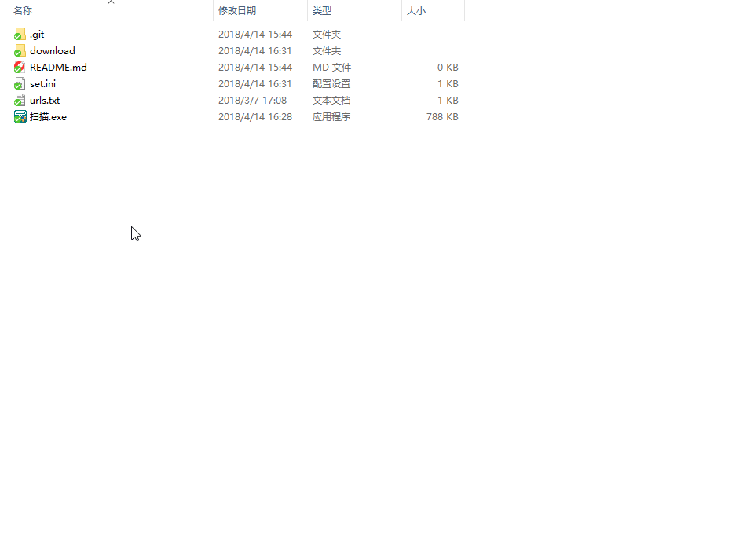

# 扫站点源码

Usage:

其实这个工具不怎么有用，毕竟现在能扫到的站越来越少了，字典自己随便写的。

支持自定义请求头, 自定义代理, 设置扫描线程, 扫描延时等等
为了更优雅的写字典，甚至实现了一个简单的语法分析器。

环境变量(最先处理)
# 目前只有这一个
${domain} = 当前扫描的域名(如 http://example.com, 则${domain}=example.com)
声明变量语法
# [compress_ext] = zip|rar|tar|tar.gz|tgz|tar.bz2|tar.xz|7z
然后就是扫描的字典了
/web.[compress_ext]
所以urls.txt全文可以这样写，还是这样的字典看起来舒服
# [compress_ext] = zip|rar|tar|tar.gz|tgz|tar.bz2|tar.xz|7z
/web.[compress_ext]
